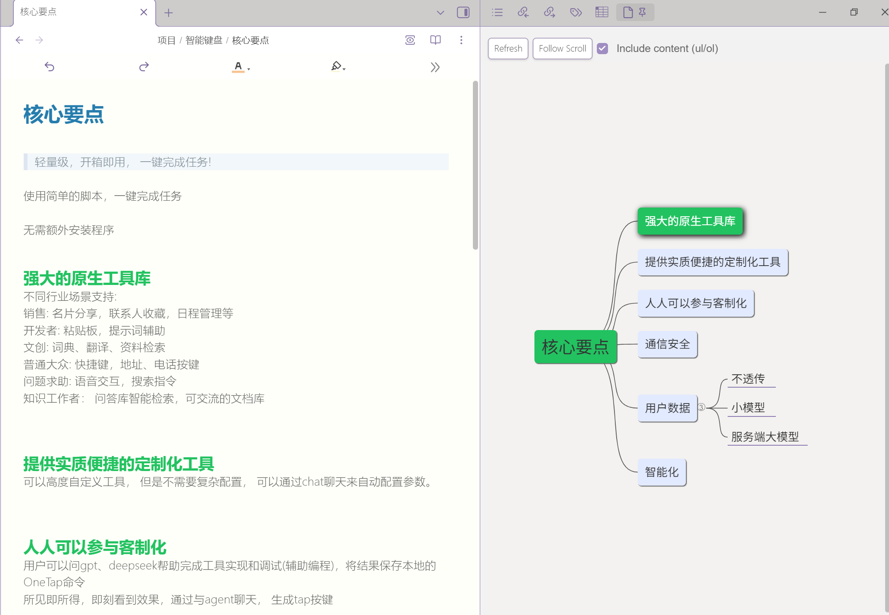

# Mindmap Preview (jsMind)



# 手动安装与使用说明

## 构建

### 一键构建脚本（macOS/Linux）

```bash
./build-plugin.sh
```

脚本将自动：
- 检查 `vendor/jsmind-repo` 是否存在，不存在则执行：`git clone git@github.com:hizzgdev/jsmind.git vendor/jsmind-repo`
- 执行 `npm run build` 构建插件
- 将 `vendor/jsmind-repo/es6/jsmind.js` 和 `vendor/jsmind-repo/style/jsmind.css` 复制到 `vendor/jsmind/`

如需单独构建 jsMind 并复制产物，可使用：

```bash
./build-jsmind.sh
```


## 手动安装

- 将以下文件/目录复制到你的库：`<你的库>/.obsidian/plugins/obsidian-mindmap-jsmind/`
  - `manifest.json`
  - `main.js`
  - `vendor/jsmind/es6/jsmind.js`
  - `vendor/jsmind/es6/jsmind.screenshot.js`
  - `vendor/jsmind/style/jsmind.css`
  - `vendor/dom-to-image/dom-to-image.min.js`

示例（iCloud 库路径）：
```bash
mkdir -p \
  "$HOME/Library/Mobile Documents/iCloud~md~obsidian/Documents/个人/.obsidian/plugins/obsidian-mindmap-jsmind/vendor/jsmind/es6" \
  "~/Library/Mobile Documents/iCloud~md~obsidian/Documents/个人/.obsidian/plugins/obsidian-mindmap-jsmind/vendor/jsmind/style"

cp -f manifest.json main.js \
  "$HOME/Library/Mobile Documents/iCloud~md~obsidian/Documents/个人/.obsidian/plugins/obsidian-mindmap-jsmind/"

cp -f vendor/jsmind/es6/jsmind.js \
  "$HOME/Library/Mobile Documents/iCloud~md~obsidian/Documents/个人/.obsidian/plugins/obsidian-mindmap-jsmind/vendor/jsmind/es6/"

cp -f vendor/jsmind/style/jsmind.css \
  "$HOME/Library/Mobile Documents/iCloud~md~obsidian/Documents/个人/.obsidian/plugins/obsidian-mindmap-jsmind/vendor/jsmind/style/"
```

## 启用插件
- 打开 Obsidian → 设置 → 第三方插件：关闭“安全模式”。
- 在列表中启用 “Mindmap Preview (jsMind)”。

## 使用
- 打开一个 Markdown 文件，执行命令：`Preview current markdown as mindmap`。
- 在右侧思维导图视图：
  - Add Child：在所选节点下添加子标题（同步写入 Markdown）。
  - Rename：重命名所选节点（同步更新标题行）。
  - Delete：删除所选节点及其内容块（同步从 Markdown 删除对应段落）。
  - Refresh：重新解析并渲染。
- 点击导图节点会在编辑器中滚动并选中对应标题文本。

## 说明
- H1 作为中心节点；H2/H3… 为二/三…级节点；无 H1 时使用文件名作为中心节点。
- 保持 Markdown 段落顺序与正文文本不变。
- jsMind 资源已本地化到 `vendor/jsmind/`，离线可用。

## 参考
- jsMind 项目与用法：[jsMind](https://github.com/hizzgdev/jsmind)
